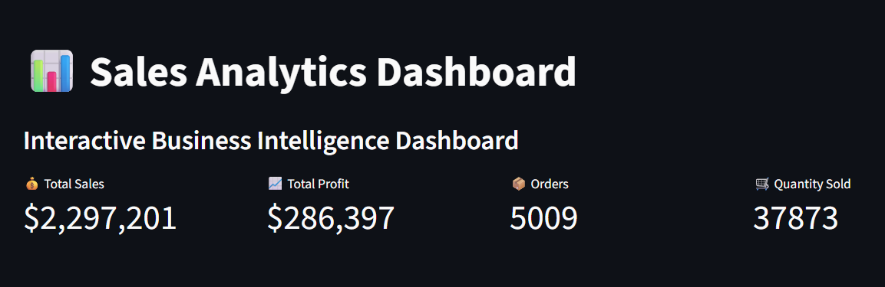
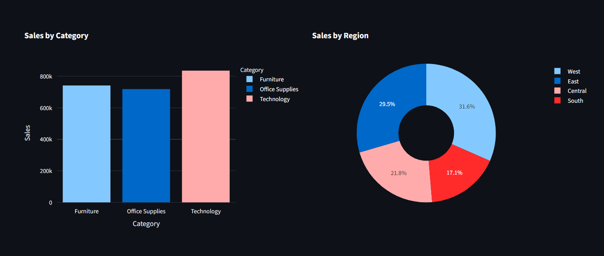
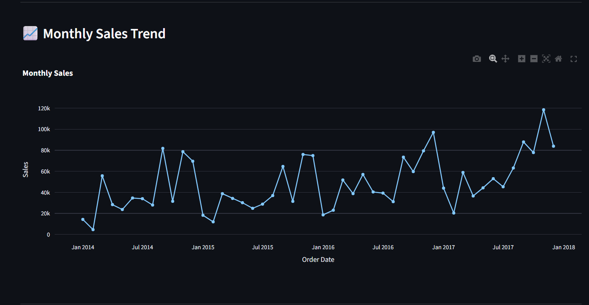

# 📊 Sales Analytics Dashboard

An interactive Sales Analytics Dashboard built with **Python, Streamlit, Pandas, and Plotly** to analyze business performance, sales trends, customer insights, and profitability.

---

## 🚀 Live Demo

👉 **[Open the Live Dashboard](https://sales-analytics-dashboard-aedf48ldsbaieusorzkbz6.streamlit.app/)**

---

## 📸 Dashboard Preview

### Dashboard Overview



### Sales Analysis



### Monthly Sales Trends



---

## ✨ Features

- 📈 Interactive Sales Dashboard
- 🌍 Region-wise Sales Analysis
- 📊 Category & Sub-Category Analysis
- 💰 Profit Analysis
- 📅 Monthly Sales Trends
- 🎯 KPI Cards
- 🔍 Dynamic Filters
- 📥 Download Filtered Dataset

---

## 🛠️ Tech Stack

- Python
- Streamlit
- Pandas
- Plotly Express
- NumPy

---

## 🚀 Skills Demonstrated

- Data Analysis
- Business Intelligence
- Data Visualization
- Dashboard Development
- Python Programming
- Git & GitHub
- Streamlit Deployment

---

## 📂 Project Structure

```text
sales-analytics-dashboard
│
├── app.py
├── requirements.txt
├── README.md
├── LICENSE
│
├── images/
│   ├── dashboard_overview.png
│   ├── sales_analysis.png
│   └── trends.png
│
├── data/
│   └── Superstore/
│       └── Sample - Superstore.csv
│
├── notebooks/
│   └── analysis.py
│
└── utils/
    ├── load_data.py
    └── charts.py
```

---

## ⚙️ Installation

### 1. Clone the repository

```bash
git clone https://github.com/sudeepamohanty57/sales-analytics-dashboard.git
```

### 2. Go inside the project folder

```bash
cd sales-analytics-dashboard
```

### 3. Create a virtual environment

```bash
python -m venv venv
```

### 4. Activate the virtual environment

**Windows:**

```bash
venv\Scripts\activate
```

### 5. Install dependencies

```bash
pip install -r requirements.txt
```

### 6. Run the dashboard

```bash
streamlit run app.py
```

---

## 📊 Dataset

The dashboard uses the **Sample Superstore** dataset, which contains retail sales records including orders, customers, products, regions, sales, discounts, and profit.

---

## 👩‍💻 Author

**Sudeepa Mohanty**

- GitHub: https://github.com/sudeepamohanty57
- LinkedIn: https://www.linkedin.com/in/sudeepa-mohanty-a808293b6/

---

## ⭐ Support

If you like this project, consider giving the repository a ⭐ on GitHub!
